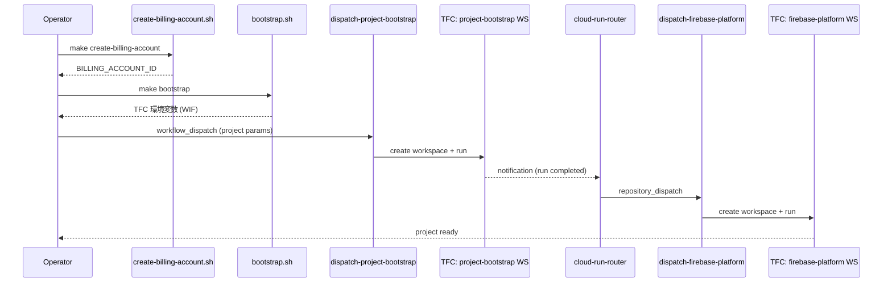

# Getting Started

本リポジトリが提供するコンポーネントを使って、GCP Project の作成から Firebase Platform の構築までを一通り実行するためのエンドツーエンド導入ガイドです。

---

## 全体フロー

---

## コンポーネント一覧

| # | コンポーネント | パス | 説明 |
|---|----------------|------|------|
| 0 | Billing Account 作成 (script) | [`scripts/create-billing-account.sh`](../../scripts/create-billing-account.sh) | Master Billing Account 配下に新規 Billing Account を作成 |
| 1 | Infra 用 GCP Project 作成 (script) | [`scripts/bootstrap.sh`](../../scripts/bootstrap.sh) | `infra-bootstrap` Project / SA / WIF を構築 |
| 2 | GCP Project 作成を dispatch する共通 GitHub Action | [`actions/dispatch-project-bootstrap/`](../../actions/dispatch-project-bootstrap/) | `project-factory-{service}` Workspace へ Run を起動 |
| 3 | Dispatch で作成された Workspace で plan/apply する Terraform Module | [`modules/project-bootstrap/`](../../modules/project-bootstrap/) | GCP Project / SA / IAM を管理 |
| 4 | Workspace からの webhook を受け次の Action を dispatch する Cloud Run | [`cloud-run-router/`](../../cloud-run-router/) | TFC notification → GitHub `repository_dispatch` |
| 5 | Cloud Run から dispatch され Firebase 設定の Workspace 作成 + plan/apply する共通 GitHub Action | [`actions/dispatch-firebase-platform/`](../../actions/dispatch-firebase-platform/) | `{service}-{env}` Workspace を upsert → Run 起動 |
| 6 | Action が作成した Workspace の定義ファイル | [`modules/firebase-project-platform/`](../../modules/firebase-project-platform/) | Firebase / GCP サービスリソースを管理 |

---

## Service Account / セキュリティモデル (重要)

このプラットフォームの SA 設計の要点。詳細は [iam-policy.md](../project-bootstrap/design/iam-policy.md) / [wif-attribute-mapping.md](../project-bootstrap/design/wif-attribute-mapping.md)。

| SA | 置き場所 | 権限 | 誰が使える |
|----|----------|------|-----------|
| **Factory SA** `terraform-project-factory` | `infra-bootstrap` | org/folder の projectCreator + projectIamAdmin、billing.user | **factory workspace のみ** (`project-factory-*`) |
| **per-env SA** `terraform-{service}-{env}` | **各ターゲット project 内** | そのターゲット project の `owner` | その env の firebase workspace のみ (`{service}-{env}`) |

設計のポイント:

1. **per-project SA**: env ごとの terraform SA は infra ではなく**作成したターゲット project の中**に作る。これにより quota / 課金 / 権限 / ライフサイクルがその project に閉じ、infra に `project 数 × env 数` 分の SA が溜まらない (GCP は 1 project あたり SA 100 個上限)。
2. **強権 SA の利用主体を限定** (WHO): Factory SA を impersonate できるのは `project-factory-` で始まる workspace だけ (WIF 派生属性 `terraform_workspace_kind`)。無関係な workspace からの成り代わりを遮断。
3. **影響範囲の封じ込め** (WHAT): GCP **folder** を用意できる環境では Factory SA の権限を folder スコープに限定 (blast radius を folder 内に封じ込め)。bootstrap は `.env` の `FOLDER_NAME`（例 `infra`）から folder を find-or-create し `FOLDER_ID` を自動解決できる。folder が無い環境 (org 直下) でも floor (WHO 限定) は確保される。**folder 推奨**。

---

## 前提条件

以下のツール・アカウントが必要です:

- **gcloud CLI** — インストール済み + `gcloud auth login` で認証済み
- **Terraform Cloud (TFC)** — Organization が作成済み
- **GitHub** — リポジトリへの push 権限 + GitHub App (Actions 連携用)
- **GCP 権限** — Organization Admin または相当の IAM role

---

## 手順

| Step | ガイド | 概要 |
|------|--------|------|
| 0 | [00-billing-account.md](./00-billing-account.md) | Billing Account 作成 (master billing account 保有者のみ) |
| 1 | [01-bootstrap.md](./01-bootstrap.md) | `infra-bootstrap` Project / SA / WIF の構築 |
| 2 | [02-tfc-setup.md](./02-tfc-setup.md) | Terraform Cloud Organization / Project / Workspace の初期準備 |
| 3 | [03-github-actions.md](./03-github-actions.md) | GitHub Actions (`dispatch-project-bootstrap`, `dispatch-firebase-platform`) の設定 |
| 4 | [04-cloud-run-router.md](./04-cloud-run-router.md) | Cloud Run Router のデプロイと TFC Notification 設定 |
| 5 | [05-end-to-end.md](./05-end-to-end.md) | エンドツーエンドの通し検証 |

> **Note**: Step 0 は master billing account (Reseller / Channel Partner) を持つ場合のみ必要です。既に Billing Account がある場合は Step 1 から始めてください。
